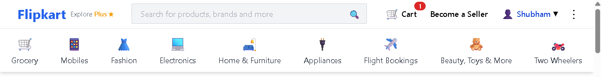

# 🛒 Flipkart Frontend Clone

A responsive and modern frontend clone of Flipkart built using **React.js** and **Material-UI**. This project replicates key UI elements of the Flipkart e-commerce platform.

## 🚀 Features

- 🏠 Clean homepage layout with banners and product sections  
- 🔍 Search bar with icon  
- 🧑 User login UI (static/mock)  
- 🛒 Cart icon and navigation header  
- 📱 Mobile responsive  
- 🎨 Styled using Material-UI

## 🖼️ Screenshots

### 🏠 Homepage
 

## 🛠️ Tech Stack

- **Frontend**: React.js  
- **UI Library**: Material-UI  
- **Icons**: Material Icons  
- **Routing**: React Router

## 📁 Project Structure

